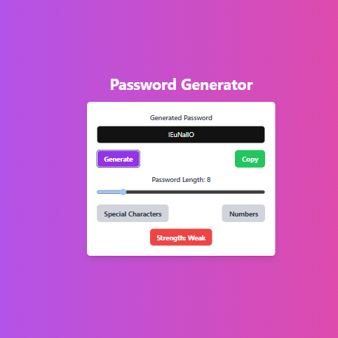
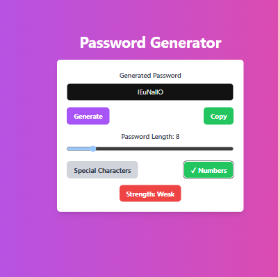
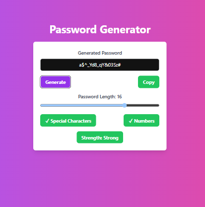
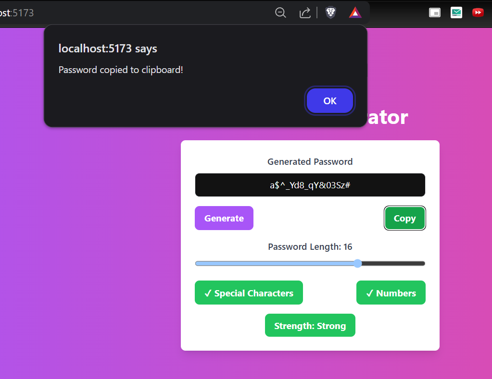

# 🔐 Password Generator

A sleek and simple password generator built with React and Tailwind CSS. Generate strong, customizable passwords with ease — including options for special characters, numbers, and adjustable length.

---

## 🚀 Features

- Generate random passwords of customizable length (6–20 characters)
- Option to include **special characters** and/or **numbers**
- Password **strength indicator** (Weak, Medium, Strong)
- One-click **copy to clipboard**
- Beautiful, responsive UI built with Tailwind CSS

---

## 📸 Preview

| Description                  | Screenshot                 |
|-----------------------------|----------------------------|
| Password generated          |  |
| With numbers                |  |
| With numbers & characters   |  |
| Clipboard copy feature      |  |

---

## 🛠 Tech Stack

- **React** (Functional Components, Hooks)
- **Tailwind CSS**
- **JavaScript (ES6+)**

---

## 📦 Installation

```bash
# Clone the repository
git clone https://github.com/yourusername/password-generator.git
cd password-generator

# Install dependencies
npm install

# Start the development server
npm start
